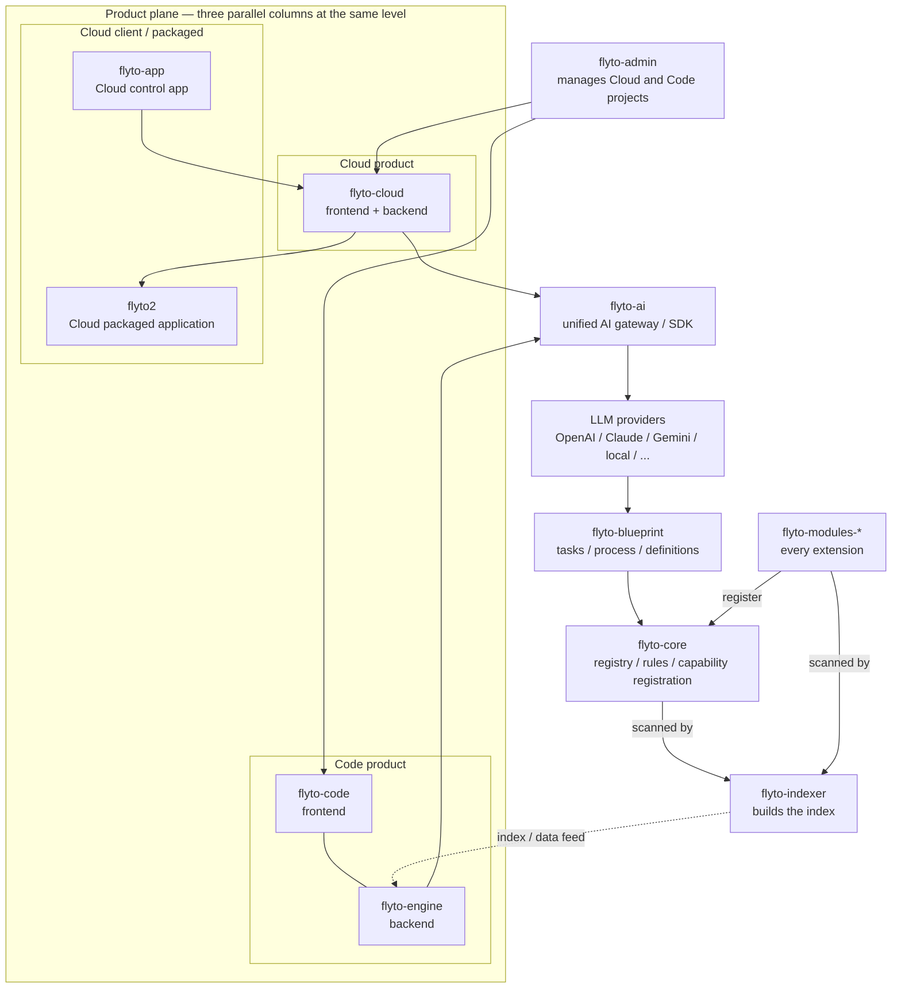

# Architecture

## Canonical Flytohub product topology

This is the durable product and ownership map for the whole Flytohub line. It
is **not** a claim that every arrow is a synchronous runtime call; the
runtime-call diagrams start in the next section. It is maintained in parallel
in [`docs/architecture-map.md`](docs/architecture-map.md).



Compact text invariant, so a renderer's layout choice cannot erase the meaning:

```text
flyto-admin  ── manages ──>  Cloud project  and  Code project

THREE PARALLEL COLUMNS, SAME LEVEL (never nest Code/Engine under Cloud):

  LEFT (Cloud client)        CENTER (Cloud product)     RIGHT (Code product)
  flyto-app           ──>    flyto-cloud                flyto-code    (frontend)
  flyto2              <──    (frontend + backend)              +
  (packaged app)                                        flyto-engine  (backend)

              flyto-cloud ──>  flyto-ai  <── flyto-engine
                        (unified AI gateway / SDK)
                                    |
              LLM providers (OpenAI / Claude / Gemini / local / ...)
                                    |
              flyto-blueprint (tasks / process / definitions)
                                    |
              flyto-core (registry / rules / capability registration)
                                    ^
              flyto-modules-*  ──register──>  flyto-core

              flyto-core       ──scanned by──>  flyto-indexer
              flyto-modules-*  ──scanned by──>  flyto-indexer
              flyto-indexer    ──index / data feed──>  flyto-engine
```

Invariants:

- `flyto-admin` sits above and manages both the Cloud and the Code project.
- `flyto-cloud` and the combined `flyto-code` / `flyto-engine` column sit at
  exactly the same horizontal level. Code and Engine are never drawn as
  children below Cloud.
- The left column holds `flyto-app` above `flyto2`. `flyto-app` points across
  to `flyto-cloud`, and `flyto-cloud` points back across to `flyto2`; neither
  is stacked inside the center Cloud column.
- `flyto-cloud` owns its own frontend and backend; `flyto-code` is the Code
  frontend and `flyto-engine` is the Code backend in one product column.
- Both product columns converge on `flyto-ai`, the unified AI gateway/SDK.
- The platform chain below `flyto-ai` is LLM providers -> `flyto-blueprint` ->
  `flyto-core`. Every `flyto-modules-*` extension registers with Core.
- `flyto-indexer` scans `flyto-core` and every `flyto-modules-*` extension as
  two separate inputs, builds the index, and feeds it to `flyto-engine`. That
  lower arrow is an index/data feed only; it does not place Engine lower in the
  product hierarchy.

This map is the governing target, not a claim that every edge is already
implemented. The dated current-alignment snapshot — including the
`flyto-engine` direct-provider migration gap and the unverified
`flyto-cloud` -> `flyto2` packaging edge — is in
[`docs/architecture-map.md`](docs/architecture-map.md#current-alignment-snapshot-2026-08-08).

Runtime flow:

```text
user/cloud/CLI
  -> Agent
  -> provider chat loop
  -> ToolRegistry
  -> flyto_ai.tools.core_tools
  -> flyto-core MCP handler
  -> structured result + evidence metadata
  -> blueprint/eval/trace feedback
```

The reusable control loop is domain-neutral even though each high-risk domain
adds its own contract:

```text
goal / event / sensor input
  -> flyto.goal-frame.v1 normalization
  -> manifest and compatibility routing
  -> policy / scope / authorization gate
  -> domain planner or Agent tool loop
  -> flyto-core or explicit domain executor
  -> domain verification + bounded repair/re-plan
  -> redacted evidence / trace / trusted Blueprint feedback
```

`Agent` owns general workflows; `FlytoCodingAgent` adds workspace, thread,
check, and attributable-change semantics; `RoboticsPlanningService` adds route
integrity and robot safety planning; `run_security_campaign` adds explicit
authorization, scope, action, module, and budget ceilings. New domains attach a
typed adapter at these boundaries instead of adding task-name branches to the
shared loop.

Key boundaries:
- Providers never call `flyto-core` directly.
- Cloud imports `flyto-ai` contracts and dispatchers, not `flyto-core` internals.
- Blueprint learning stores successful tool chains and redacted evidence, not
  secrets. Portable exchange is explicit; Flyto2 AI does not publish bundles by
  itself.
- Model-facing Blueprint outcome calls are community observations. Only the
  deterministic closed-loop executor can attach the in-process capability that
  records `local_verified` evidence.
- Blueprint signing keys and trusted publisher mappings stay host-controlled
  and are never exposed through model tool schemas.
- MCP metadata is additive: existing tool names, schemas, and result shapes stay compatible.

Runtime packages:
- `coding` is the provider-neutral software-development control plane. It owns
  versioned requests/results, workspace-confined argv-only tools, persistent
  resumable threads, append-only redacted trajectories, source-controlled real
  checks, negotiated MCP-stdio capability adapters, and optional tenant-scoped
  HTTP/MCP job facades. It does not import sibling Indexer/Core source trees.
- `assistant` and `intelligence` perform deterministic pre-routing, recovery, selector resolution, and interaction control before provider fallback.
- `providers` normalize model chat, streaming, tool calls, usage, failover, and cost records.
- `tools` owns definitions and handlers; Core registry definitions are discovered lazily instead of copied.
- `memory`, `evolution`, `cache`, `session`, and `transcript` retain bounded learning and evidence state.
- `permissions`, `prompt`, `redaction`, `vault`, `sandbox`, and `agents` enforce execution and data boundaries.
- `channels`, `telegram`, `scheduler`, and `extensions` adapt external events without bypassing the agent/tool contract.

Coding control flow:

```text
CLI / API
  -> flyto_ai.coding.CodingTaskRequest (flyto.coding.v1)
  -> source-controlled checks + required-capability preflight
  -> selected Flyto2 LLMProvider
  -> workspace-confined coding tools + configured MCP-stdio adapters
  -> real check runner
  -> bounded repair loop
  -> CodingTaskResult + append-only JSONL evidence
```

Full-stack capability composition remains additive and process-bound:

```text
FlytoCodingAgent
  -> flyto-indexer (context / impact / task gates)
  -> flyto-blueprint (workflow discovery / reuse / learning)
  -> flyto-page-inspector (real DOM inspection only)
  -> flyto-core (module / recipe execution and visual evidence)
  -> source-controlled checks and bounded repair
```

`flyto_ai.coding.stack` retains that built-in preset and also loads arbitrary
source-controlled agent-stack profiles. `compose_capability_stack()`
has no domain catalog; `CapabilityManager` satisfies the generic
`ToolExecutor` protocol and can attach the resulting tools to `Agent`. Each
lane negotiates its real MCP catalog independently and exposes only
`CapabilitySpec.allowed_tools`; manifest-loaded MCP lanes require an explicit,
non-empty allowlist. The Blueprint and page-inspection lanes may use the same
server implementation without sharing model-visible authority. Removing one
spec detaches that lane without changing the provider, workspace tools, checks,
or result contract. Page inspection continues to flow through `core_tools`;
its portable launch policy tries bundled Chromium and then system Chrome,
records the selected channel, and never bypasses Core.

Policy-bearing `flyto.agent-stack.v2` profiles classify every exposed MCP tool
as read-only, workspace-write, or danger-full. This declaration never grants
authority: `CapabilityManager` receives its ceiling from the runtime host and
checks it at every dispatch, while `Agent` independently applies the same
provider-name overrides in its safe dispatcher. Core module execution also
re-evaluates the concrete `module_id`, preserving danger-category escalation
after MCP tool names have been isolated. Legacy v1 manifests remain accepted
with their historical workspace-write default.

The implementation is deliberately finer-grained than the public API:

```text
flyto_ai.coding.stack (stable facade + CLI)
  -> stack_manifest (bounded I/O, schema, composition, configured fingerprint)
  -> stack_presets  (detachable built-in catalog only)
  -> stack_probe    (runtime negotiation and observed fingerprint)

flyto_ai.coding.capabilities (stable facade + lifecycle coordinator)
  -> mcp_session    (handshake and call orchestration)
     -> mcp_transport (isolated process, bounded JSON-RPC, deterministic close)
     -> mcp_catalog   (scope, provider names, machine-readable result status)
  -> tool_registry  (transactional routing and collision rejection)
  -> permissions    (host ceiling plus monotonic argument-risk resolvers)
  -> execution_policy (budgets, concurrency, sandbox paths, secrets, approval)
  -> execution_trace  (redacted hash chain, deterministic replay, feedback)

flyto_ai.coding adapter quality plane
  -> conformance      (one-adapter contract/runtime/domain/lifecycle suite)
  -> scenario_matrix  (bounded aggregation with no domain-name branches)
```

The ordinary `Agent` separately validates and binds the generic
`ToolExecutor`. A new domain extends `CapabilitySpec`, its profile, and an
optional host-owned argument-risk resolver; it does not add task-name branches
to the manager. Registry updates commit only after the complete session catalog
has validated. Any collision or incomplete mapping closes all affected
sessions and clears runtime dispatch metadata. Transport close first closes
stdin and awaits EOF, then uses bounded terminate/kill escalation, so repeated
attach/detach cycles do not leave orphaned subprocess transports.

The runtime quality plane is additive and independently replaceable.
`ExecutionPolicyController` grants an exactly-once concurrency lease only
after argument byte/depth/node, secret-key, workspace-path,
elapsed/call/failure, approval-timeout, concurrency, and result budgets pass.
`ExecutionTraceLedger` records Manager execution and Agent-level denials in a
deeply immutable, redacted content-addressed hash chain. Replay uses a fixed
snapshot and the same safe dispatcher; it defaults to replay-safe read-only
events, requires explicit permission opt-in for writes/dangerous work, skips
redacted arguments, supports domain-owned normalizers, and publishes an
idempotency-ready Blueprint outcome through a host-owned sink.
`run_adapter_conformance()` verifies one adapter's declared permissions,
complete tool coverage, handshake, exact catalog, domain cases, execution
evidence/policy lease closure, and idempotent shutdown. The separate scenario
matrix runs arbitrary sets of those suites under bounded concurrency;
workflow, page, robotics, and authorized-security fixtures are tests, not
branches in production routing. Both conformance entry points default to
read-only authority; controlled write or danger fixtures must opt in
explicitly, and an expected domain failure must still prove whether dispatch
occurred.

Optional service composition:

```text
loopback HTTP (bearer + idempotency) / MCP stdio (configured tenant)
  -> optional stable code-mcp-supervisor -> replaceable code-mcp worker
  -> flyto.coding-service.v2
  -> tenant namespace + workspace allowlist + bounded queue
  -> per-workspace serialization
  -> flyto.coding-route.v1 host-owned lanes
       Indexer pre-work        (mandatory: context, real plan, ordered
                                steps, gates, before any model edit)
       Blueprint discovery     (read-only, relevance-checked projection)
       -> exactly one startup-selected implementer
            native -> the FlytoCodingAgent control flow above
            claude -> ClaudeCodingAgent (optional adapter, same contracts)
          + required source-controlled checks
       Core validation         (allowlisted calls closed by validate_params)
       Indexer post-work       (mandatory: task.validate, task.gate.verify,
                                verify.strict on the final workspace)
  -> awaiting_codex_audit bound to an exact implementation_revision_sha256
  -> authenticated host/auditor verdict
  -> durable CodingJobReceipt + secret-free CodingRouteReceipt
```

Every host-owned Indexer search in this chain is scoped to the workspace
project. An unscoped smart search fans out across every indexed project and
exceeded the 30-second capability bound, failing the mandatory pre-work lane
before any implementer could start. Lane evidence also survives a partial
lane: a failed lane receipt keeps every completed call plus one failed call
naming the exact host-derived action (`structure`, `search`, `task.plan`,
`task.gate.<phase>`, `task.validate`, `verify.strict`), and a transport
timeout is classified `capability_timeout` instead of collapsing into
`domain_failure`.

Optional emergency overflow (`flyto.coding-emergency.v1`, startup-only):

```text
strict route fails before the implementer, with a positively classified
route-infrastructure code (capability_unavailable | capability_timeout)
in a pre-implementer lane, no attributable edit, no recorded start
  -> host-owned circuit breaker (per process, monotonic, opens once)
  -> the same startup-selected implementer, called directly
     + the same required source-controlled checks
     + the same exact-revision binding
  -> awaiting_codex_audit under a separate digest-validated
     EmergencyAuthorityReceipt, never under CodingRouteReceipt(strict=True)
  -> the same independent Codex audit; still never commits or pushes
```

The overflow lane is authority, not a fallback. It is granted per process by
an explicit startup flag naming the exact implementer; it never triggers for a
domain refusal, gate denial, stale index, malformed evidence, failed check,
failed implementation, Core failure, Indexer post failure, audit rejection, or
rework exhaustion; and it never runs a second implementation for a job whose
durable record already recorded a start. Recovery is a new process: a repaired
build starts with a closed circuit and publishes a new build id.

`flyto.coding-route-status.v1` adds bounded durable runtime status under the
state root. Each service instance owns `status/instance-<id>.json` and shares
`status/index.json`, so concurrent `code-mcp` processes never overwrite one
another's diagnostics. A record carries an opaque instance id, an immutable
build digest of the loaded coding sources, process id, start time, lifecycle,
job state, route lane/action, stable failure code, implementer-start truth,
and bounded session/revision ids — never a message, path, error text, file
list, environment, or credential. Per-job JSON stays authoritative; this is a
pointer for a Codex that restarted, read by `flyto-ai code-status`.

For a long-lived local MCP host, `code-mcp-supervisor` owns the stable stdio
edge shown above. It compares the current coding-source digest at request
boundaries, replaces only a terminal/idle worker, and replays initialization.
A known non-terminal job keeps its worker and exact implementation session;
only a competing new submission is denied until that job terminates. A direct
worker also compares its immutable startup build with disk before accepting a
new job, so source drift cannot silently run stale implementation logic.

The lanes are host-owned, not a prompt convention. `flyto_ai.coding.route`
owns the typed policy, the allowlists, the bounded loops, and the evidence.
The implementer receives no audit tool and cannot assert that a lane ran: a
lane outcome is derived only from completed allowlisted calls. A missing
catalog, failed domain result, incomplete required gate, malformed evidence,
or unavailable Indexer fails the round closed, so it never reaches
`awaiting_codex_audit`. Source-controlled checks remain the trusted host
command lane; a green check does not substitute for the Indexer post-gate.
Core validation flows through `flyto_ai.tools.core_tools` with a
validation-only allowlist that excludes `execute_module` and browser
authority. Blueprint is read-only discovery that yields a compact
content-addressed projection, never an executed workflow.

Provider selection, credentials, tenant identity, workspace roots, the state
root, the implementer, the rework ceiling, and the audit requirement are all
startup dependencies. None is accepted from a job payload. This makes Cloud,
Engine, Robotics, Core, and Indexer consumers replaceable at the process
contract instead of coupling their source trees to `flyto-ai`.

### Domain neutrality of the shared control plane

`flyto-ai -> LLM -> flyto-blueprint -> flyto-core -> modules -> flyto-indexer
-> flyto-engine` records extensible responsibility and data flow. It is not a
mandatory synchronous call chain that every task must traverse.

The neutrality invariant binds the **shared composition, routing, and control-plane
core**: it must not branch on a profile or domain name, and must not inject a
fixed task list, provider, or repository-shaped flow. A domain it has never seen
must compose and negotiate exactly like one it has.

Bounded **domain adapters are expected to be domain-specific**, and that is not a
violation. An adapter may add its own safety, permission, planner, verifier, and
evidence rules, and may branch freely on them inside its own boundary — a
robotics profile enforcing motion-safety limits, an authorized security profile
constraining engagement scope, or the coding profile requiring an exact-revision
worktree audit are all legitimate. What an adapter may not do is push those rules
back down into the shared layer, or make the shared layer aware of which domain
is calling it. Domain-specific authority lives in the adapter and its declared
contracts; the core stays name-agnostic.

- Blueprint stores and reuses portable task/workflow knowledge across domains.
- Core remains the registry, policy, and execution authority.
- Indexer observes and indexes declared capabilities and feeds Engine. It is
  not assumed to be invoked by every non-code task.

A profile is an arbitrary bounded identifier, and so are its capability names,
tool names, and contract versions. Software development, penetration testing,
red-team exercises, robotics, workflows, and ordinary tasks are *examples of
inputs*, never an enum, switch, component map, provider rule, or sanctioned
list. Anything the identifier grammar accepts must compose and negotiate
identically; `tests/test_agent_stack.py` proves this with profile, capability,
tool, and contract identifiers generated from a digest rather than chosen.

`flyto_coding` and its `flyto_coding_*` MCP tools are **one Codex-facing
adapter/profile over this shared layer**, not the universal core and not the
only future entry point. The audit-required route, the durable workspace claim,
and same-session rework described below are scoped to that adapter, because
they answer a question only a repository-editing domain asks: who exclusively
owns a worktree between an implementation and its exact-revision audit. They
are deliberately not a general-purpose distributed scheduler, and no other
domain is required to adopt them.

The state root is a shared durable namespace, not a process-lifetime singleton.
Multiple `code-mcp` processes may attach to it concurrently. Short exclusive
state guards cover cross-record decisions such as idempotency and audit state;
crash-released per-job leases prove which process owns an execution round; and
hashed per-workspace locks serialize filesystem edits across processes. A new
process reconciles an interrupted job only when it can acquire that job's
lease, so it never marks another live conversation's work `service_restarted`.
Atomic JSON replacement remains the persistence boundary. None of these locks
changes tenant scoping, route gates, audit authority, or implementer selection.

Those three scopes bound one execution round each. An audited job also needs
ownership that outlives a round, because the interval between "the implementer
finished" and "an auditor read the tree" is exactly when a competing Codex
frontend could edit the same worktree and invalidate a revision that was never
wrong. A fourth scope covers it: a durable **workspace claim** under
`locks/workspaces/<digest>.owner.json`, held for the whole job across
`queued`, `running`, `awaiting_codex_audit`, `rework_queued`, and
`rework_running`, and released only on `completed`, `codex_accepted`, a
terminal failure, or an explicit host abandon. Rework re-asserts the claim it
already holds rather than re-acquiring it, so a job never queues behind itself.

The claim file is an index; the job record is the authority. A claim resolves
to `held` only while its owning record sits in a claim-owned state, and to
`free` only when that record proves the job settled. Anything else — corrupt
JSON, an unknown version or shape, an unreadable file, a claim naming a job
this state root has no record of — resolves to `unresolved` and refuses the
edit with `workspace_claim_unresolved`. An unresolved claim is never deleted
automatically, including by startup reconciliation: discarding it would convert
"ownership cannot be evaluated" into "nobody owns this tree", which is the
concurrent-edit hazard the claim exists to prevent. Only the host-owned
`flyto-ai code-release` command clears one.

Because the claim protects the audit gap, only an audit-required job takes one.
A legacy direct-library service takes no claim and keeps its per-round
serialization, but it still honours a claim another job holds, so it can never
edit a worktree mid-audit.

Same-session rework is likewise no longer tied to one process. A bounded,
redacted **resume envelope** under `tenants/<ref>/resume/<job>.json` persists
only the public request fields plus the job, request-digest, and session
bindings. It is loadable exactly when its `session_bound` equals the record's
`implementation_session_id`, is always rebuilt with `resume=true` against that
same session, and can therefore continue a session but never start one.
Startup authority — approval policy, sandbox mode, config path, sandbox image,
checks, capabilities — is never persisted and is re-imposed from the running
process, so a stored request cannot outlive or widen the policy it ran under.

The native implementer is the default and `claude` is its peer, selected once
with `--implementation-backend` or the bounded `FLYTO_AI_CODING_BACKEND`
default. There is no per-job selection and no fallback between them. The
public `code-mcp` and `code-serve` commands are audit-required
unconditionally: an implementer round reaches `awaiting_codex_audit`, and only
an `accept` verdict on that exact revision reaches `codex_accepted` with
`landable` evidence. A `rework` verdict returns typed findings to the same job
and implementation session for another bounded round. `landable` is evidence
only; the service never stages, commits, pushes, publishes, or deploys.

`ClaudeCodeAgent` also remains a separate direct compatibility backend for
`flyto-ai code`, outside the audited service route, and never receives
implicit permission bypass. A capability can be removed from
`.flyto/coding.yaml` without changing the provider, workspace tool, check, or
result contracts. The full state machine and audit surfaces are in
[`docs/CODING_CONTROL_PLANE.md`](docs/CODING_CONTROL_PLANE.md).

An MCP capability is available only when its initialize response negotiates the
requested protocol and its real `tools/list` includes every required tool.
Configured version labels alone never satisfy preflight. When `allowed_tools`
is configured, every listed tool must exist and only that subset enters the
provider tool catalog; omitted allowlists preserve the prior full-catalog
behavior.
MCP transport success is not treated as domain success: structured content or
a single JSON content block carrying `ok: false` or an error status fails the
capability result before the Agent can trust the evidence.
Authenticated product adapters receive only explicitly named `FLYTO_*` runtime
variables. The source-controlled contract carries names rather than values;
ambient cloud, source-control, SSH, and provider secrets do not cross the
subprocess boundary.

Model-issued commands are a separate trust lane from source-controlled checks.
The former require a detected OS sandbox, deny network and workspace/host
writes, and receive only an ephemeral writable home; the latter are trusted
project verification and may execute repository code. Native file tools reject
VCS internals, credential paths, path traversal, and symlink escape.

Interface surfaces:
- Python consumers import the package facade documented in `docs/API.md`.
- CLI and HTTP/SSE clients use contracts documented in `docs/CLI_AND_MCP.md`.
- MCP hosts negotiate JSON-RPC protocol versions and discover tools at runtime.
- Generated symbol and operator references under `docs/reference/` remain source-derived and are checked in CI.

Core contract:
- `get_core_capability_manifest` reports contract version, installed core version, tool fingerprint, recipes support, module categories, and per-tool risk metadata.
- `execute_module` validates params before execution when `flyto-core` exposes `validate_params`.
- Tool logs include `mcp.source`, `mcp.contract_version`, and module or recipe identity.

## Adaptive security campaign boundary

```text
LLM planner
  -> typed campaign + proposed PlanIR steps
  -> scope / authorization / allowlist / budget gate
  -> existing closed-loop MCP plan
  -> permission gate + flyto-core validation and execution
  -> assertions + compact proof evidence
  -> allowlisted, raw-content-free planner projection
  -> bounded re-plan or verified verdict
```

- The LLM is the decision and prioritization layer; it never becomes execution
  authority. Every round enters through the existing four-tool MCP contract.
- The campaign contract is part of plan identity. Changing target scope,
  authorization, mode, module allowlist, budget, or prior usage changes the
  stored plan hash.
- Active probes, exploit validation, and credential validation require
  progressively stronger authorization. Active steps also require an explicit
  in-scope target and a proof assertion.
- Authorization expiry, scope, module allowlist, request budget, and cost
  budget are checked again at dispatch time, including repaired steps.
- Evidence returned to a subsequent model round is an allowlisted projection
  containing facts and fingerprints, never raw bodies, HTML, headers, cookies,
  credentials, prompts, or attacker-controlled error text.
- A successful Core call alone is not a security verdict. Verification requires
  the runtime closed loop, assertions, budgets, and one proof record per
  executed request; otherwise the verdict is `not_proved`.

## Mission Stations interpretation boundary

```text
judge physically draws Zone + Objective cards
  → operator records card_source=judge_draw
  → deterministic request/card/capability validation
  → LLM sees cards as immutable data and APPROVED capability IDs only
  → bounded reading + clarification + capability candidates
  → independent output validation
  → live interpretation or deterministic card-only fallback
  → card evidence copied outside model output with content hashes
  → Cloud plans/assigns; Robotics validates/executes
```

`mission_interpretation.py` owns this boundary without importing Cloud or
Robotics source. The provider schema has no fields for evidence requirements,
resource identity, assignment, executor kind, task status, completion, or raw
commands. The model therefore cannot draw the cards, rewrite the challenge,
bind a robot, authorize motion, or declare success.

The independent validator requires `card_source=judge_draw`, preserves the
exact evidence array, enforces required capabilities against the APPROVED
registry ceiling, and rejects actuator-shaped fields recursively. Invalid or
unavailable provider output produces a deterministic fallback using the card
goal and required capabilities. The attestation records hashes and a bounded
reason class, never raw provider error text.

## Robotics planning boundary

```text
Flyto2 Robotics routed request
  -> validate request size, shortlist, capabilities, locations, routes
  -> compile provider-native JSON Schema
  -> structured model completion
  -> independent plan/safety/route validation
  -> optional single bounded repair
  -> plan + tamper-evident planning attestation
  -> Flyto2 Robotics final validation and execution
```

- `robotics_planning.py` owns the provider-neutral request, response, and
  attestation boundary. It does not import Flyto2 Robotics source.
- The routed capability shortlist is the authority ceiling. Model output cannot
  introduce a capability or argument field outside that contract.
- Complete route candidates become exact JSON Schema `prefixItems` variants.
  Model choice remains real, while waypoint omission and cross-route splicing
  become structurally invalid.
- Provider validation is not execution authorization. Flyto2 Robotics verifies
  the hashes, route, policy, and executable plan again before movement.
- `robotics_planner_server.py` is a loopback development adapter, not a public
  authenticated service. It suppresses prompt-bearing access logs and bounds
  request, response, timeout, and error detail sizes.

## Coding mission and state-root authority boundary

Every coding job serves a **mission** in the workload-neutral kernel
(`flyto_ai.orchestration.mission_control`). The coding adapter
(`flyto_ai.coding.mission_runtime`) owns the whole coding vocabulary: when a
caller names no mission, it synthesizes one whose objective is the caller's own
immutable request message, whose desired result is an attributable verified
revision accepted by independent Codex audit, and whose criteria name the
implementation revision, the checks pinned at admission, and that audit. The
kernel learns none of this. It is the authority for cross-process queue order,
repair-lane preference, dependency readiness, resource exclusion and fencing;
the canonical worktree is claimed as a resource **by digest, never by path**.

Two leases carry execution, and they mean different things.

*The job lease covers execution, never admission.* Once a job's record,
idempotency record, resume envelope, round envelope and mission work item are
durable, the admitting service releases the lease **before** any pump exists.
Any compatible worker may then execute the store-selected round from durable
state alone. Holding it from admission until the submitting instance's own pump
happened to reach the job made the global queue offer that item to other
services, which had to refuse and requeue it - burning a dispatch attempt and a
fencing token per refusal.

*The state-root authority lease binds one semantic authority to one root.* The
coding route is startup-fixed: implementer, audit requirement, contract path,
sandbox, approval policy, host lane policies and rework ceiling are decided
before a job exists. Every compatible live service holds a **shared** `flock` on
`<state_root>/.authority.lock` for its whole life; a newcomer first attempts the
**exclusive** lock, and only that proof of "nobody else is alive here" permits
writing the bounded, secret-free marker in `<state_root>/authority.json`.
Rotation therefore needs both no live holder *and* every job terminal. A
mismatch is refused before status reconciliation, the workspace-claim sweep and
any pump, so an incompatible service never consumes an attempt and never sweeps
another authority's audit-gap claim. Liveness is the kernel's answer: a crashed
service releases its share when its descriptor closes, so recovery needs no TTL
and no heartbeat, and a paused service is never declared dead. Lock order is
authority-lease -> state-guard, always.

*Validation precedes every write.* Marker validation, active-job validation and
any pre-fingerprint settlement all run under the state guard while the caller
holds the exclusive lock, and the marker is written only after all of them pass.
A refused start-up therefore leaves a present marker byte-identical and never
creates one - otherwise a stranger could replace a lost marker, then fail on an
open job, and lock out the worker that was actually correct. `None` from the
marker reader means one thing only: no file exists. A marker that is a link, is
not a regular file, exceeds its small byte bound, does not decode, or does not
match its exact schema is a refusal. Neither the lease file nor the marker is
ever opened by name twice: each is opened once with `O_NOFOLLOW` (and
`O_CLOEXEC` for the marker), and every later question - regular file, size,
contents - is asked of that same descriptor, so a name replaced after a check
cannot be the file that is then read. An unreadable or state-less job record is
likewise a refusal rather than an assumption that the job finished.

Teardown mirrors this. The whole of `close` after the service marks itself
closed sits inside one `finally` that releases the state-guard descriptor and
then the authority lease, so a failure draining the executor, releasing job
leases or writing the closing status row can never leave a stopped service
holding the root against its successor.

Where the host has no inter-process lock the service refuses to start at all
(`CodingAuthorityUnavailable`, `execution_authority_unavailable`) rather than
degrading: advertising multi-process isolation a host cannot keep is worse than
declining the host.

The authority fingerprint is a recursive canonical digest of the *whole*
validated startup policy, including nested Indexer, Blueprint, Core and
`RouteLimits` semantics, and including every string exactly as configured -
capability argv and executable paths among them, because two lanes invoking
different binaries are different route semantics and a state root is host-local
anyway. Only the digest is persisted; no raw path reaches `authority.json`, a
record, a receipt or a log. It deliberately excludes `build_id`, which a hot reload
changes without changing what would execute; build identity is still enforced
where it belongs, at admission. Records predating the fingerprint are adopted only on proof and never on
absence. Queued pre-execution work - `implementer_started` false, a flag written
*before* the provider call - is migrated and runs normally. An executing record
is never adopted, because `implementation_backend` is recorded on *outcome*, so
an empty backend may mean a provider round is in flight: if its job lease is
held the service refuses to start beside it, and if the lease is provably free
the job is terminalized with its mission item and worktree claim accounted. Only
an unfingerprinted *awaiting-audit* job is accept-but-not-rework: a verdict
describes a revision the host already hashed, but a new round would adopt this
service's route policy on behalf of a job that never named one.

This boundary changes no product topology: `flyto-cloud` remains parallel to the
combined `flyto-code` / `flyto-engine` column. See `DECISIONS.md` (2026-08-10)
for the rationale and operator semantics.

## Coding continuation boundary

A bounded provider stop keeps its session; carrying it into a second job is an
explicit, single-use **continuation authority** owned by the host, not a property
of the session id. The authority is tenant-partitioned, binds the exact backend
session, workspace, attributable revision, whole-workspace snapshot, snapshot
policy and verification contract, and advances only through an append-only
hash-chained journal whose tail is the sole monotonic source. Claiming is a
compare-and-swap under an exclusive lock, so many Codex processes sharing one
state root produce exactly one owner.

The projection a snapshot is taken under is explicit and digest-bound. The default
observes every entry that is not root version-control state. Only the strict public
route - the one whose mandatory Indexer pre/post gates independently revalidate the
tree and record it in the route receipt - may classify `.flyto-index` as
control-plane runtime state, and that classification is frozen into the authority.

This boundary changes no product topology: `flyto-cloud` remains parallel to the
combined `flyto-code` / `flyto-engine` column, and no repository ownership or
integration arrow moves. See `docs/CODING_CONTROL_PLANE.md` for the state layout
and the stated threat limit, and `DECISIONS.md` (2026-08-10) for the rationale.

## Coding rework plan-authority boundary

A multi-round rework is one root Indexer task. After a successful pre-lane the
exact contract is sealed privately into the job record, bound to that job, its
root request and its workspace and protected by a content digest; a later round
re-proves it before the resumed implementer edits anything and passes it back so
the plan is amended rather than re-rooted. The cumulative attributable set is
proven before the proof lanes and is the single ordered tuple that Indexer
post-validation, the persisted attributable files and the audited revision digest
all bind - equality, not inclusion.

Plan-authority refusals are closed, terminal and report `verification` or
`workspace` phase with `resubmit_against_current_contract`. A capability's own
`reason_codes`/`required_actions` reach host-owned blockers only when they
already are machine codes.

No product topology changes: `flyto-cloud` remains parallel to and level with the
combined `flyto-code` / `flyto-engine` column, and no repository ownership or
integration arrow moves. See `docs/CODING_CONTROL_PLANE.md` and `DECISIONS.md`
(2026-08-10).
