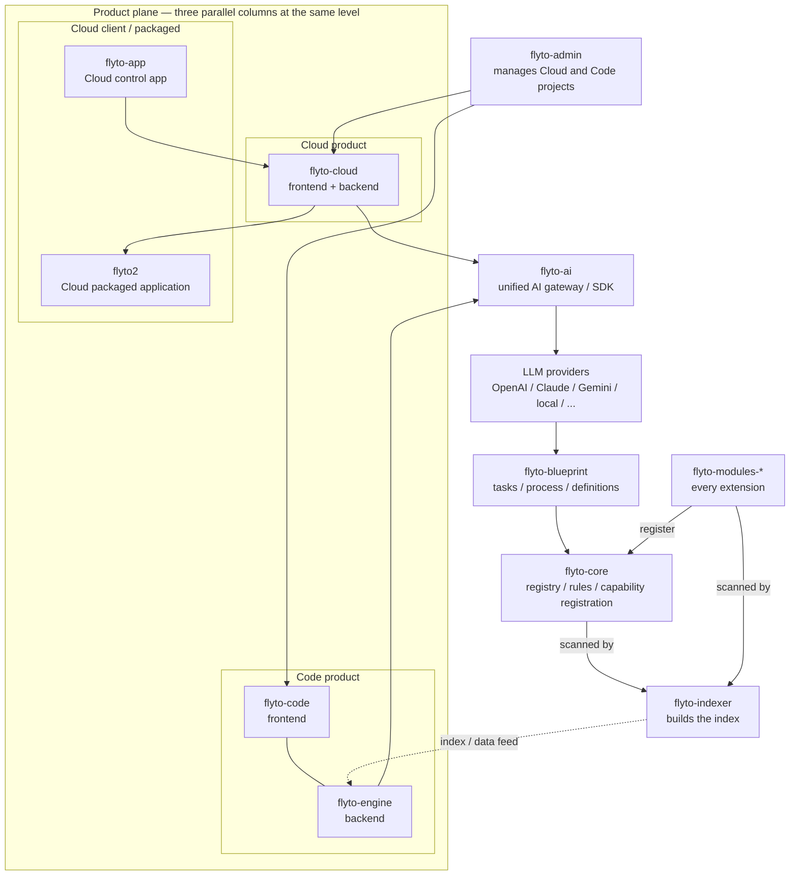

# Architecture Map

## Canonical Flytohub product topology

Durable product and ownership map for the whole Flytohub line. It records who
owns what and which products integrate, **not** that every arrow is a
synchronous runtime call — the runtime-call boundary is in
[Provider Boundary](#provider-boundary) below. This section is maintained in
parallel with the same diagram in [`../ARCHITECTURE.md`](../ARCHITECTURE.md);
change both together.



Compact text invariant, so a renderer's layout choice cannot erase the meaning:

```text
flyto-admin  ── manages ──>  Cloud project  and  Code project

THREE PARALLEL COLUMNS, SAME LEVEL (never nest Code/Engine under Cloud):

  LEFT (Cloud client)        CENTER (Cloud product)     RIGHT (Code product)
  flyto-app           ──>    flyto-cloud                flyto-code    (frontend)
  flyto2              <──    (frontend + backend)              +
  (packaged app)                                        flyto-engine  (backend)

              flyto-cloud ──>  flyto-ai  <── flyto-engine
                        (unified AI gateway / SDK)
                                    |
              LLM providers (OpenAI / Claude / Gemini / local / ...)
                                    |
              flyto-blueprint (tasks / process / definitions)
                                    |
              flyto-core (registry / rules / capability registration)
                                    ^
              flyto-modules-*  ──register──>  flyto-core

              flyto-core       ──scanned by──>  flyto-indexer
              flyto-modules-*  ──scanned by──>  flyto-indexer
              flyto-indexer    ──index / data feed──>  flyto-engine
```

Invariants:

- `flyto-admin` sits above and manages both the Cloud and the Code project.
- `flyto-cloud` and the combined `flyto-code` / `flyto-engine` column sit at
  exactly the same horizontal level. Code and Engine are never drawn as
  children below Cloud.
- The left column holds `flyto-app` above `flyto2`. `flyto-app` points across
  to `flyto-cloud`, and `flyto-cloud` points back across to `flyto2`; neither
  is stacked inside the center Cloud column.
- `flyto-cloud` owns its own frontend and backend; `flyto-code` is the Code
  frontend and `flyto-engine` is the Code backend in one product column.
- Both product columns converge on `flyto-ai`, the unified AI gateway/SDK.
- The platform chain below `flyto-ai` is LLM providers -> `flyto-blueprint` ->
  `flyto-core`. Every `flyto-modules-*` extension registers with Core.
- `flyto-indexer` scans `flyto-core` and every `flyto-modules-*` extension as
  two separate inputs, builds the index, and feeds it to `flyto-engine`. That
  lower arrow is an index/data feed only; it does not place Engine lower in the
  product hierarchy.

Changing any cross-repo ownership, product role, integration arrow, coding
route, or repository name in this map is an architecture change. See the
architecture-invariant rule in [`../AGENTS.md`](../AGENTS.md).

## Current alignment snapshot (2026-08-08)

The topology above is the **governing target**. This snapshot records where the
current code still differs, so an agent does not assume the map is already
fully implemented. Status values are deliberately narrow:

- **implemented** — a concrete source artifact exercises the edge;
- **partial** — the edge exists but a contradicting path also exists;
- **target** — intended, not yet evidenced in code;
- **unverified** — not checked in this pass; do not assert either way.

Evidence below comes from a repository inventory pass on 2026-08-08. It is a
point-in-time observation, not a continuously enforced check.

| Edge | Status | Evidence / gap |
| --- | --- | --- |
| All named repositories exist | implemented | Present in the Indexer inventory. |
| `flyto-app` -> `flyto-cloud` | implemented | `flyto-app` `scripts/audit_mobile_cloud_contract.py` audits the App/Cloud contract. |
| `flyto-cloud` -> `flyto2` (packaging) | unverified | `flyto2` currently has 0 indexed files, so the packaging edge is not code-index verified. |
| `flyto-cloud` -> `flyto-ai` | implemented | `flyto-cloud` `src/ui/web/backend/tests/unit/test_ai_moat_integration.py` exercises `flyto_ai` tool dispatch. |
| `flyto-engine` -> `flyto-ai` as the only AI gateway | **partial / migration gap** | `flyto-engine` still contains `internal/ai/openai.go::OpenAIProvider`, a direct provider path that bypasses the gateway. Treat single-gateway routing as target until that is migrated. |
| `flyto-ai` -> `flyto-blueprint` | implemented | `flyto_ai/tools/blueprint_tools.py`. |
| `flyto-ai` -> `flyto-core` | implemented | `flyto_ai/tools/core_tools.py`. |
| Host-validated capability retrieval -> `flyto-ai` routing | implemented | `flyto_ai/capability_router.py` preserves Blueprint-owned request/model/index/snapshot/page/candidate digest meanings and Cloud-owned query-context/requirements/feasibility/result meanings under frozen host validation. The producer dialect includes 128-character model IDs, `/`-capable identifiers, and active/ACL/risk/resource filters; results remain candidate-only without execution authority. Empty capability IDs mean open discovery; Cloud feasibility is bounded independently of page membership. `CAPABILITY_GROUP_LIMIT` caps 32 groups and independent `EMITTED_PROVIDER_ROW_LIMIT` caps 32 rows without partial groups. Locked producers: Blueprint `f3eb62eff97fac3b3f19d2f1c8d7c1e71664894b`, Core `a048bc47de158c096b7010642452e4d41d21748c`, Indexer `b492ef9b663f4a37c4883e2b9e1d8b45b3719b6d`. Cloud stays parallel to Code/Engine. |
| Core registration mechanism exists | implemented | `flyto-core` `src/core/modules/registry/core.py` `ModuleRegistry` with registration validation. This proves the mechanism only. |
| Every `flyto-modules-*` extension actually registers | unverified | No complete module inventory plus per-module registration trace was performed. Do not read the row above as universal compliance. The invariant still governs: every extension must register with Core. |
| Core extension management is host-only | implemented | `flyto_ai/tools/core_tools.py` exposes `list_core_extensions`, `list_core_extension_kinds`, `install_core_extension`, and `uninstall_core_extension` as host functions under `flyto.core.extension-management.v1`, bound to `core.plugin.loader` (`get_plugin_loader`, `EXTENSION_KINDS`, `normalize_extension_name`, `ExtensionResult`) and calling `list_extensions` / `install_extension` / `uninstall_extension`. `list_extensions` takes no kind argument, so the kind filter is host-side. They are generic over the kinds Core declares (`kind`, `prefix`, `entry_point_group`), preserve Core's normalized names and result codes, and return one fixed envelope (`code`, `name`, `version`, `previous_version`, `install_enabled`, `restart_required`, `rolled_back`, `refresh_failed`) with no installer output. Mutation requires `FLYTO_EXTENSIONS_INSTALL_ENABLED`. No install-shaped tool reaches `get_core_tool_defs` or `dispatch_core_tool`. |
| `flyto-indexer` -> `flyto-engine` index feed | implemented | `flyto-engine` `internal/scanner/scanner.go::populateLayer3FromIndexer`. |
| Indexer / Blueprint / Core surround every public audited coding job | implemented | `flyto_ai/coding/route.py` runs the mandatory Indexer pre/post lanes, Blueprint discovery, and Core validation around whichever implementer startup selected. All four lanes are configured on every strict public route; none is detachable. Blueprint and Core may resolve only `applied` or `not_applicable`. Every project-aware Indexer plan analysis (`search`, `impact`, `structure`, `call_hierarchy`) carries the host-derived workspace project; conflicting project evidence is rejected before analysis or editing, so an isolated worktree never falls through to ambient indexes. The Indexer preset and public route share a finite ten-minute transport bound so large or contended strict verification can finish while every gate remains fail-closed. The Claude service adapter accepts one already-authorized SDK JSON frame up to a fixed 8 MiB ceiling so a legitimate large Indexer result does not hit the SDK's 1 MiB default; legacy direct calls retain that default, and no tool or route authority is widened. The explicit `codex` backend starts a separate logged-in Codex CLI thread with user config/rules ignored, no MCP/plugins/web search, a scrubbed environment and a bounded workspace sandbox; the host still owns session binding, snapshots, checks, route lanes and the independent exact-revision audit. Its valid bounded `turn.completed` event closes the model turn even if later CLI teardown exits non-zero; that exit stays in evidence, while missing completion, invalid output, timeout, failed checks and no-change work remain fail-closed. One execution plan may select the published legacy (`assess` / `implement`) or current (`plan_changes` / `apply_changes`) Indexer gate family; unknown, duplicate, or mixed-family plans fail before dispatch. On rework, the host unions the authenticated parent ledger, revision/audit-proven prior attributable paths and the new finding's filesystem-validated explicit targets before asking Indexer to amend the root plan; its canonical cumulative scope must match that ordered union exactly. The stdlib-only amendment domain verifies Indexer's parent/content/entry digests, ids, complete linkage, normalized host project, profile/context mirrors and exact path partition, then reuses only an exact parent-step multiset occurrence; missing instruction context fails closed, novel original-path analysis and every successor gate execute. The pinned verifier's effective compatibility ceiling is generation seven, and every executable delta remains inside the ordinary step bound. Structured Indexer failures preserve only exact host-registered machine reasons/actions, never unknown tokens, prose, paths or secrets. Post validation accepts the legacy Boolean verdict or the current `overall=pass` envelope only when both bounded ruff/pytest statuses agree. Blueprint reuse requires token overlap and ranks ordered phrase overlap before catalogue order, so a direction-bearing transform is not replaced by its reverse. Proved by `tests/test_coding_route.py` against the installed Indexer end to end, the real Core adapter (`array.join` validated), and the real Blueprint adapter (`ConvertCSVtoJSON` projected), plus `tests/test_codex_cli_backend.py` for the Codex process boundary. |
| Long-lived Codex MCP process -> current coding worker | implemented | `flyto_ai/coding/mcp_supervisor.py` keeps host stdio stable, detects coding-source build drift, and preserves non-terminal work owned by that connection: its successful submits plus a correctly addressed successful `flyto_coding_audit(verdict=rework)` returning the same job in `rework_queued` or `rework_running`. Reads and other audit outcomes never adopt foreign work; only exact submit/get/audit responses may observe a job, so unknown tools cannot clear a pin. Matching terminal get/audit observation or durable state releases an existing pin before safe inner-worker replacement. `CodingService.submit` independently rejects a stale direct worker before mutation. |
| Pre-provider audit-rework route recovery | implemented | A failed Indexer/Blueprint rework route remains bound as `rework_route_blocked`. The existing submit tool exposes the explicit Boolean `retry_rework_route`; it requires the original key/request identity, exact session/revision/audit/mission/plan/workspace/execution proof, and preserves a same-job claimed continuation. Mission operation recall is status-validated, one exact peer-deferred publication child may be compensated, and repeated publication loss closes action-free as `rework_route_recovery_exhausted` while releasing claims and resume state. Ordinary replay never retries and the MCP inventory remains three tools. |
| `flyto-indexer` scans Core and modules | unverified | Inventory confirms the repositories; the two scan inputs were not separately traced in this pass. |
| `flyto-admin` manages both projects | partial | Cloud admin surfaces exist and `backend/internal/engine/scans.go::codeOrg` touches the Code side; evidence is not strong enough to claim complete two-product project management. |

Agents changing any of these edges must re-verify the current repository state
first, update this table with the new status and evidence, and follow the
architecture-invariant rule in [`../AGENTS.md`](../AGENTS.md).

## Core Areas

- `flyto_ai/agent.py`, `flyto_ai/assistant/`, and `flyto_ai/orchestration/`:
  prompt routing, sub-agent coordination, approvals, resilience, and agent
  execution flow.
- `flyto_ai/tools/core_tools.py`: the only supported adapter path from
  `flyto-ai` into `flyto-core` MCP modules and recipes.
- `flyto_ai/providers/`: OpenAI, Anthropic, Ollama, and failover adapters.
  Providers may request tool calls, but they must not call `flyto-core`
  directly.
- `flyto_ai/prompt/`, `flyto_ai/redaction.py`, `flyto_ai/permissions.py`, and
  `flyto_ai/vault.py`: AI governance, prompt-injection guardrails, permission
  checks, redaction, and local secret handling.
- `flyto_ai/memory/`, `flyto_ai/evolution/`, and `flyto_ai/intelligence/`:
  reusable memory, blueprint learning, prompt evolution, scoring, and planning.
- `flyto_ai/mcp_server.py` and `flyto_ai/mcp_client.py`: MCP-compatible server
  and client entry points for external tool/runtime integration.
- `flyto_ai/coding/mcp_supervisor.py`: stable local coding-MCP host edge with a
  build-aware, safely replaceable `code-mcp` worker. Every worker read is
  deadlined at 30 seconds; a missed deadline terminates the wedged worker
  without retrying the request, and hot-reload tracking self-heals from durable
  job records so a client that stops polling cannot pin reloads.
- `flyto_ai/coding/service.py`: durable job state for the audited route,
  including job-lifetime workspace claims that keep one worktree exclusive
  across the Codex audit gap and every rework round, and the session-bound
  resume envelope that lets any live worker continue — never restart — the
  original implementation session. Claims are keyed by workspace digest, so
  parallel jobs in different repositories are unaffected.
- `docs/`, `workflows/`, and `handoffs/`: project memory, release process, and
  handoff evidence.

## Cross-Repo Edges

- `flyto-core` is the execution/runtime authority. `flyto-ai` consumes core
  capability manifests, module schemas, `validate_params`, recipes, and
  execution results through `flyto_ai.tools.core_tools`.
- `flyto-cloud` consumes `flyto-ai` assistant, app automation, marketplace,
  workflow, crawler, and template-agent capabilities through stable contracts.
- `flyto-code` and `flyto-engine` consume AI governance, fix reasoning, evidence
  narration, and policy/runtime decisions without importing provider-specific
  code directly.
- `flyto-indexer` verifies source context, impact, security, prompt/audit
  hygiene, and Flyto2 product-line release evidence.
- `flyto-blueprint`, `flyto-pro-core`, and `flyto-pro` provide learning,
  extension, and commercial module capabilities that must remain optional for
  community/open-core surfaces.

## Provider Boundary

```text
Flyto2 Cloud / CLI / MCP client
  -> flyto-ai agent / orchestration
  -> provider adapter
  -> tool-call request
  -> ToolRegistry
  -> flyto_ai.tools.core_tools
  -> flyto-core MCP module or recipe
  -> structured result + evidence metadata
```

- Hosted providers are adapters, not product authorities.
- Provider prompts and responses must pass through redaction, prompt safety,
  permissions, and evidence logging boundaries.
- Local or airgapped deployments must be able to replace hosted providers with
  local endpoints or rules-only operation without changing `flyto-core`.

Governed execution-session admission has one provider-neutral host seam. A
pre-established one-shot trusted connector handle may receive a detached bounded
prepared session only in its non-daemon worker process, under the durable
Scheduler one-shot fence. Admission never starts a process. Neither the callback
nor its identity is request data or durable data. The catalog retains only content-free
session/task IDs, four digests, and the Scheduler-owned result/evidence
projection. Exact success is connected; absent, failed, malformed, interrupted,
or unknown outcomes fail closed, and a possibly entered occurrence is never
replayed after restart. One monotonic deadline is derived at admission and
bounds worker readiness, nonblocking transfer, child-side connector entry, and
result receive; entry recomputes its remainder and zero remainder makes no callback.
Duplicate reconciliation uses that same deadline with only an additional fixed
0.5-second closure grace. Every invocation is isolated in a dedicated
non-daemon child process; timeout and owner cancellation forcibly terminate it
and confirm zero live connector work before a return or durable receipt closure.
No global connector slot or detached task remains.
A waiting duplicate keeps reconciling the durable fence after an owner exits;
it does not merely poll or invoke another connector. No Cloud consumer or device
execution is implemented by this edge, so the canonical product topology is
unchanged.

## Product-Line Role

- Flyto2 Cloud / Apps / Automation: agent app building, crawler automation,
  workflow assistance, template generation, and marketplace flow reasoning.
- Flyto2 Security: AI governance, code/security fix reasoning, evidence
  explanation, redteam consent messaging, and report narrative support.
- Flyto2 Data: future dataset, knowledge-base, vector/search, and data
  governance agent workflows.
- Flyto2 Zero-person Company Agent: operating-system layer for research,
  content, support, sales, development, monitoring, and reporting tasks.
- Flyto2 Big Data / Intelligence: large-scale summarization, trend synthesis,
  threat/brand/GEO visibility analysis, and intelligence report generation.

## Release Invariants

- `flyto-ai` must not duplicate `flyto-core` module schemas or bypass
  `flyto_ai.tools.core_tools`.
- Provider-specific code must not leak into `flyto-cloud`, `flyto-code`, or
  `flyto-engine` product gates.
- Prompt, evidence, memory, and provider logs must not store secrets or
  cross-tenant data.
- Enterprise/airgap mode must have a local-provider or rules-only path and must
  not require external egress by default.

## Coding control plane: phased admission and continuation policy

Runtime note only. No product ownership, repository boundary or integration arrow
changes here, and `flyto-cloud` remains parallel to - and level with - the combined
`flyto-code` / `flyto-engine` column.

`CodingService.submit` admits in phases. The verification-contract read and the
whole-workspace snapshot run under a per-workspace admission lock; the global state
guard is entered only for the short authoritative transition, which re-proves the
contract digest and compare-and-swaps the continuation authority before any lease,
worktree claim or durable record exists. Lock order is admission -> state guard.

Cross-job continuation is a tenant-partitioned, single-use authority advanced by an
append-only journal, and the snapshot projection it was granted under is digest-bound
into it. Only the strict Indexer-backed coding route may classify `.flyto-index` as
control-plane runtime state, because only that route's mandatory Indexer pre/post
gates revalidate that tree and record the result in the route receipt.

The coding service runtime floor is Python 3.11. Its pathname-free mission
authority envelope uses CPython's SQLite `serialize()` / `deserialize()` byte
binding; unsupported older hosts fail closed instead of receiving a temporary
file or downgraded continuation path. CI covers Python 3.11 and 3.12.

See `ARCHITECTURE.md`, `docs/CODING_CONTROL_PLANE.md` and `DECISIONS.md` (2026-08-10).

## Coding control plane: mission scheduling and state-root authority

Runtime note only. No product ownership, repository boundary or integration arrow
changes here, and `flyto-cloud` remains parallel to - and level with - the combined
`flyto-code` / `flyto-engine` column.

Every coding job serves a mission in `flyto_ai.orchestration.mission_control`,
which stays workload-neutral: the coding vocabulary - synthesized objective,
attributable verified revision, pinned checks, Codex audit - lives only in
`flyto_ai.coding.mission_runtime`. The kernel decides queue order, repair-lane
preference, dependency readiness, worktree exclusion by resource digest, and
fencing. The service dispatches whatever the store selected and reconstructs the
owning private request from durable envelopes, so per-submit executor timing
cannot reorder the queue.

Two leases, two meanings. The **job lease** covers execution only and is released
once a job's durable artifacts exist, before any pump can dispatch - so queued
work survives its submitter and any compatible worker may run it. The
**state-root authority lease** is a shared `flock` on `<state_root>/.authority.lock`
held by every compatible live service, with a bounded secret-free marker in
`<state_root>/authority.json`; the exclusive lock is required to write that
marker, so rotation needs no live holder *and* every job terminal. An
incompatible service fails construction before status reconciliation, the
workspace-claim sweep, or any pump. Lock order is authority-lease -> admission ->
state guard. Crash recovery is `flock` release, never a TTL.

The host release command keeps these scopes explicit. Abandonment joins the
authority lease shared, then requires the cross-process state guard, the exact
target job lease, an allowed record state, and—when queued—the exact
MissionStore item already closed blocked/deferred. Workspace-claim repair lacks
an exact target-job proof and therefore still takes the authority lease
exclusively. Neither path binds or rewrites the authority marker.

Every validation precedes every write: the marker, the active-job scan and any
pre-fingerprint settlement are checked under the state guard while the caller
holds the exclusive lock, and the marker is written last, so a refused start-up
leaves a present marker byte-identical and never creates a missing one. Damaged,
symlinked or non-regular markers and unreadable job records are refusals, not
absences. A host without an inter-process lock refuses to start
(`execution_authority_unavailable`) rather than degrading the isolation to a
no-op.

See `ARCHITECTURE.md` and `DECISIONS.md` (2026-08-10).

## Multi-Codex repository scheduling note (2026-08-12)

The outer Flytohub topology above is unchanged. Locally, the coding control
plane now leases the nearest Git repository (or one explicitly declared atomic
repo set) instead of leasing the whole Flytohub parent, so `flyto-cloud`,
`flyto-code`, and `flyto-engine` can execute in parallel at the same
architectural level when their sets do not overlap. MissionStore remains the
generic source of main-axis, side-branch and ordering truth; host-only
`code-task-window` projects that truth without adding a model-visible tool or a
domain taxonomy. Blueprint/Core/Indexer CI and local verification revisions
come from the same `stack-lock.json`.

## Coding observability note (2026-08-12)

The product topology remains unchanged. A host-only, non-AI `code-watchdog`
now observes the bounded coding status and unified task window from outside all
Codex and Claude sessions. It records only aggregate health transitions and can
publish a secret-free GitHub Actions variable heartbeat. A deterministic
scheduled GitHub workflow is the remote dead-man switch and opens one incident
when local health is degraded/critical or the heartbeat stops. This observer
has no scheduling, implementation, audit, repair, commit or push authority, so
it is not another layer in `flyto-ai -> LLM -> flyto-blueprint -> flyto-core ->
modules -> flyto-indexer`; it is an external operational witness around the
existing coding adapter.

## Scheduler convergence onto MissionStore (2026-08-12)

```text
validated schedule definition
        |
        v
bounded durable catalog ---- task + UTC due-slot key ----+
        |                                                 |
        | mission generation / work-item mapping          |
        v                                                 v
MissionStore queue -> DispatchHandle lease + fence -> async executor
        ^                                                 |
        +------ fixed or blocked closure + evidence ref --+
```

The catalog is deliberately not another scheduler state machine. It owns
definition, enablement, cursor/slot claim, bounded public result projection and
MissionStore identifier mapping only. MissionStore alone owns ready/dispatched/
closed state, worker selection, resources, live leases, fencing, heartbeats and
closure authority. This runtime diagram does not change the canonical Flytohub
product topology above.
